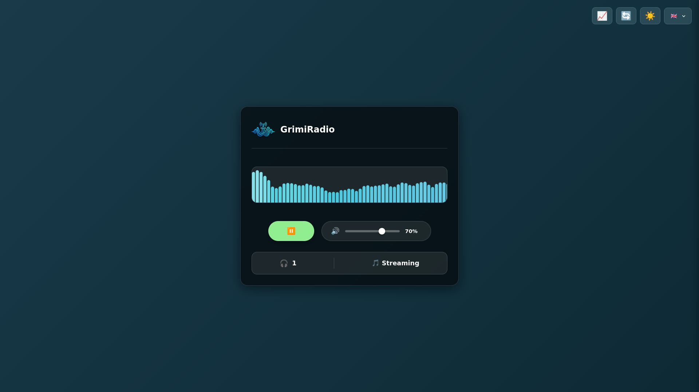
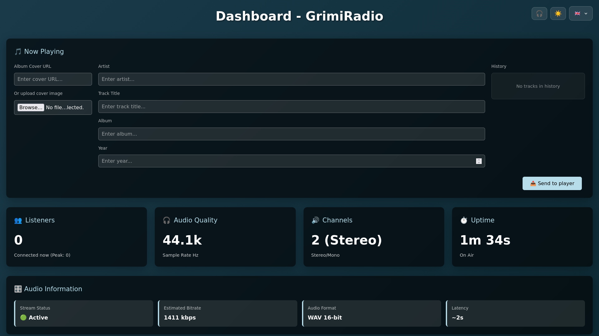
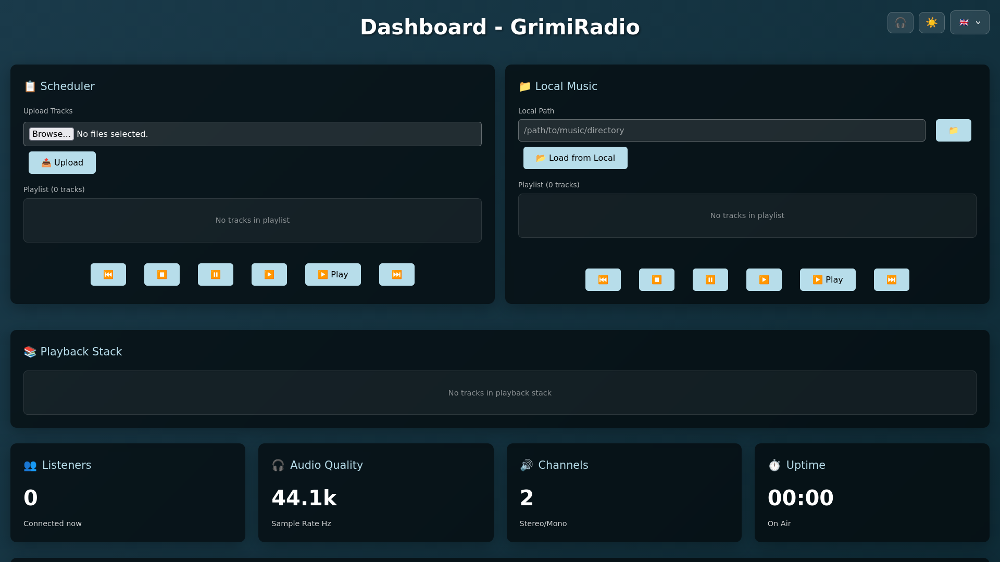
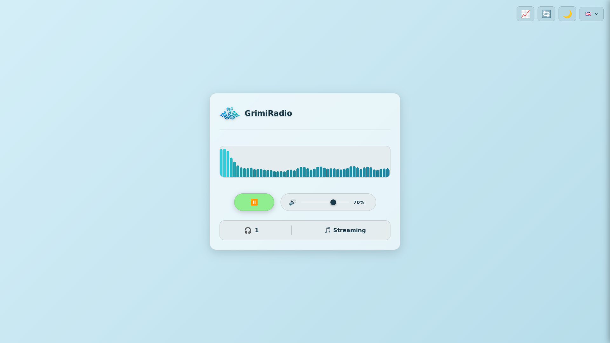
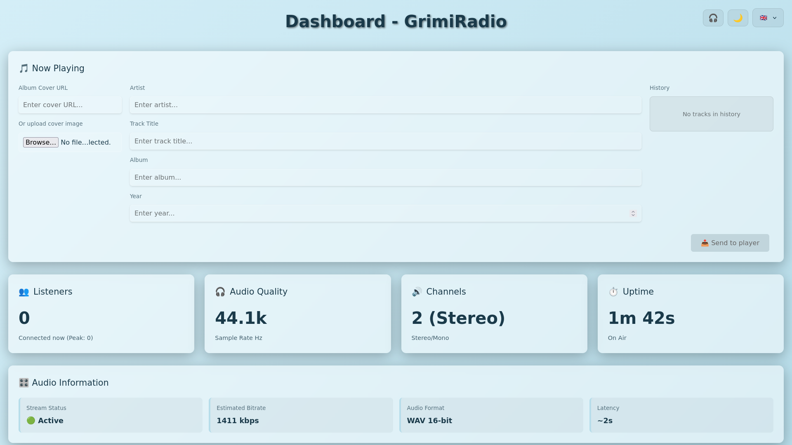
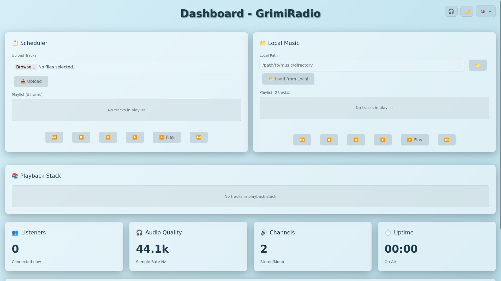

<div align="center">
  
  
  # Audio Streamer - Your Personal Radio Station
  
  <p align="center">
    <strong>Transform your computer into a professional radio station and broadcast your sound to the world.</strong>
  </p>
  
  <p align="center">
    
    
    
    
  </p>
</div>

---

### Dark Theme

<p align="center">
  
</p>

<p align="center">
  
  
</p>

### Light Theme

<p align="center">
  
</p>

<p align="center">
  
  
</p>

---

## Table of Contents

<table>
<tr>
<td width="50%">

**Getting Started**
- [Legal Disclaimer](#legal-disclaimer)
- [What You Can Do](#features---what-you-can-do)
- [Quick Start - 5 Minutes to Live](#quick-start---5-minutes-to-live)
- [Building Your Radio Station](#building-your-radio-station)
- [Going Global - Share Your Station](#going-global---share-your-station)

**Features & Configuration**
- [Professional Features](#professional-features)
- [Use Cases & Inspiration](#use-cases--inspiration)
- [Listener Experience](#listener-experience)

</td>
<td width="50%">

**Operations & Support**
- [User Manual](USER_MANUAL.md)
- [Quick Reference](#quick-reference)

**Advanced & Community**
- [Roadmap](#roadmap)
- [Contributing & Support](#contributing--support)
- [License](#license)

</td>
</tr>
</table>

---

<table border="3" bordercolor="#d32f2f" style="border-collapse: collapse;">
<tr>
<td bgcolor="#FFCDD2" style="padding: 20px;">

## Legal Disclaimer

**IMPORTANT NOTICE**: This software is a tool for audio streaming. Users are solely responsible for ensuring compliance with all applicable laws and regulations regarding music streaming and broadcasting.

**Music Streaming Licenses**

Streaming copyrighted music over the internet typically requires appropriate licenses from relevant copyright collection societies and performance rights organizations in your jurisdiction. Requirements vary significantly by country and region.

**Users should be aware that:**

- **Public streaming** of copyrighted music generally requires licenses for both composition rights (songwriters/publishers) and master recording rights (record labels/artists)
- **License requirements** depend on your location, the location of your listeners, and whether streaming is for personal or commercial use
- **Failure to obtain proper licenses** may result in legal consequences
- **This application** provides the technical means to stream audio but does not provide any streaming licenses or legal protection

**For Personal/Local Use**

Streaming within a private network or for personal use may have different or no licensing requirements depending on local laws. Users should verify applicable regulations in their jurisdiction.

**For Public/Commercial Use**

If you plan to stream to the public or use this for commercial purposes, you should:

- Consult with copyright collection societies in your country (e.g., SIAE in Italy, ASCAP/BMI in USA, GEMA in Germany, PRS in UK)
- Obtain appropriate webcasting or streaming licenses
- Ensure compliance with all relevant copyright and performance rights regulations
- Seek professional legal advice if uncertain about requirements

**Author Liability Disclaimer**

The author of this software assumes no responsibility or liability for any use of this application. Users are solely responsible for ensuring their use complies with all applicable laws and regulations. The author shall not be held liable for any legal consequences, damages, or issues arising from the use of this software for streaming or broadcasting purposes.

</td>
</tr>
</table>

---

## Features - What You Can Do

> ⚠️ **Development Warning**: This project is still under active development. You may encounter bugs or malfunctions. Please report any issues you find to help improve the project.

<table>
<tr>
<td width="50%" bgcolor="#FFF3E0">
<strong>📡 Create Your Radio Station</strong><br/>
Stream from turntables, cassette decks, mixers, or any audio source
</td>
<td width="50%" bgcolor="#E3F2FD">
<strong>🎯 Smart Audio Selection</strong><br/>
Choose between microphone or audio interface for optimal compatibility
</td>
</tr>
<tr>
<td bgcolor="#F3E5F5">
<strong>🎨 Themed Interface</strong><br/>
Light/Dark themes with instant switching
</td>
<td bgcolor="#E8F5E9">
<strong>🌍 Multilingual Support</strong><br/>
Interface available in Italian, English, and German
</td>
</tr>
<tr>
<td bgcolor="#E1F5FE">
<strong>📊 Real-Time Dashboard</strong><br/>
Live statistics with WebSocket-based updates
</td>
<td bgcolor="#FFF3E0">
<strong>📱 Responsive Design</strong><br/>
Clean, modern interface that works on all devices
</td>
</tr>
<tr>
<td bgcolor="#FCE4EC">
<strong>⚡ Professional Features</strong><br/>
Auto-reconnect, error recovery, and real-time listener stats
</td>
<td bgcolor="#FFF9C4">
<strong>🔌 Zero Configuration</strong><br/>
Works out of the box with any audio device
</td>
</tr>
<tr>
<td bgcolor="#C8E6C9">
<strong>🎵 Track Information</strong><br/>
Display artist, album, year, and album cover for your listeners
</td>
<td bgcolor="#BBDEFB">
<strong>📤 Easy Track Management</strong><br/>
Upload album covers directly from the dashboard
</td>
</tr>
<tr>
<td bgcolor="#FFF9C4">
<strong>🎧 Liquid Music Mode</strong><br/>
Upload and play music files from your computer with automatic metadata extraction
</td>
<td bgcolor="#E1F5FE">
<strong>📁 Local Music Library</strong><br/>
Load your entire music collection from any folder on your computer
</td>
</tr>
</table>

## Quick Start - 5 Minutes to Live

<table>
<tr>
<td>
<strong>⚡ Fast Setup</strong><br/>
Get your radio station live in just 5 minutes! Install dependencies, create your <code>.env</code> configuration file, and start broadcasting.
</td>
</tr>
</table>

### Step 1: Connect Your Audio Source
```
Microphone → Computer
OR
Turntable/Mixer → Audio Interface → Computer
```

### Step 2: Install & Configure
```bash
# Clone and install
git clone <this-repository>
cd audio-streamer

# Option 1: Quick install (recommended for new systems)
./install.sh

# Option 2: Manual install
# First install system dependencies for PyAudio:
sudo apt update && sudo apt install -y python3-dev portaudio19-dev
# Then install Python requirements:
pip install -r requirements.txt

# REQUIRED: Create configuration file
cp .env.example .env
nano .env  # Edit your settings

# Start your radio station
python app.py
```

**Note:** The `.env` file is **required**. The application will not start without it.

### Step 3: Choose Your Input Method
When you run the app, you'll see:
```
🎤 Choose your audio input method:
1. Microphone (built-in or USB mic)
2. Audio Interface (external sound card, line-in)
3. Liquid Music (file-based music playback)
==================================================

Enter your choice (1, 2, or 3):
```

### Step 4: Select Your Audio Device
Depending on your choice, you'll see available devices:

**For Microphone Mode:**
```
=== Available audio devices (arecord) ===
Option 1: Built-in Microphone (default)
Option 2: Line-in Jack (3.5mm)
==================================================

Choose a device index (uses ALSA device notation, or ENTER for default):
```

**For Audio Interface Mode:**
```
=== Available Audio Devices ===
0: Your Audio Interface Name
1: Another Device...
==================================================

Choose device index(es) to stream from (or ENTER for default):
```

**For Liquid Music Mode:**
```
=== Available music sources ===
1. Upload songs manually via dashboard
2. Specify local directory path
==================================================

Streaming will start when you press play in the dashboard
```

### Step 5: Go Live
1. Select your audio device from the list
2. Open `http://localhost:4986` in your browser
3. Click **Play** to start broadcasting
4. Choose your theme (Light/Dark) and language from the dropdowns
5. Click the 📊 button to view the real-time dashboard

**For Liquid Music Mode:**
1. Open the dashboard by clicking the 📊 button
2. Upload your music files or load them from a local folder
3. Click **Play** to start broadcasting your music

---

## Liquid Music Mode - Play Your Music Files

Liquid Music mode lets you broadcast music files stored on your computer. Perfect for playing your music collection without needing turntables or audio interfaces.

### How It Works

**Upload Your Music**
- Open the dashboard when using Liquid Music mode
- Click "Upload" to select music files from your computer
- Supported formats: MP3, WAV, FLAC, OGG, M4A
- The app automatically extracts song information (title, artist, album, year)

**Load From Local Folder**
- Enter the path to your music folder (e.g., `/home/yourname/Music`)
- The app loads all music files from that folder
- Perfect for your entire music library

**Control Your Playlist**
- See all your uploaded songs in the playlist
- Remove songs you don't want
- Skip forward or backward in your playlist
- Pause, resume, or stop playback at any time

**Automatic Features**
- Song information is automatically extracted from your music files
- No need to manually enter artist, album, or song titles
- Uploaded files are automatically cleaned up when you restart the app
- Security checks ensure only valid music files are uploaded

### When to Use Liquid Music

- **Personal Radio Station**: Broadcast your music collection
- **Background Music**: Perfect for businesses, cafes, or venues
- **Music Sharing**: Share your playlists with friends
- **Automated Broadcasting**: Set up a playlist and let it run

### Security

The app automatically checks every uploaded file to ensure it's a valid music file. This protects your computer from potentially harmful files while keeping your station secure.

---

## Professional Features

<table>
<tr>
<td bgcolor="#E8F5E9">
<strong>🎨 Professional Broadcasting</strong><br/>
Enjoy enterprise-grade features including light/dark themes, auto-reconnect technology, and real-time analytics. Perfect for both hobbyists and professional broadcasters.
</td>
</tr>
</table>

### Multi-Theme Web Interface
- **Light/Dark Themes**: Instant theme switching with persistent preference
- **Professional Aesthetics**: Clean, modern design optimized for readability

### Real-Time Dashboard
- **Live Statistics**: View listener count, audio quality, and uptime in real-time
- **WebSocket Updates**: No polling required - instant updates via WebSocket
- **Application Uptime**: Track how long your station has been running
- **Audio Information**: Stream status, bitrate, and format details
- **Now Playing Section**: Manage track information (artist, title, album, year, cover)
- **Album Cover Upload**: Upload cover images via URL or file upload with preview
- **Track Info Broadcasting**: Send track information to all connected listeners instantly
- **Liquid Music Dashboard**: Special dashboard for file-based music playback with playlist management
- **Automatic Metadata Extraction**: Song information automatically extracted from uploaded music files
- **Secure File Upload**: Built-in security checks to ensure only valid music files are uploaded

### Smart Web Player
- **Auto-Reconnect**: Never lose a listener - automatic retry on connection issues
- **Live Status**: Real-time connection indicators and listener count
- **Buffering Display**: Visual feedback during connection setup
- **Mobile Ready**: Works on phones, tablets, and desktops
- **Language Switcher**: Instant language changes (Italian, English, German)
- **Track Information Display**: Shows artist, album (with year), and track title
- **Album Cover Art**: Displays album cover image when available
- **Real-Time Track Updates**: Track information updates automatically via WebSocket

### Intelligent Audio Engine
- **Dual Engine Support**: 
  - **Microphone Mode**: Uses `arecord` for stable system audio capture with device selection
  - **Interface Mode**: Uses `PyAudio` for professional audio interfaces
- **Smart Device Selection**: 
  - Built-in microphone for voice/podcasting
  - Line-in jack (3.5mm) for external audio sources
  - Professional audio interfaces for music production
- **Thread-Safe**: Handle multiple concurrent listeners
- **Error Recovery**: Automatic recovery from audio device issues
- **Professional Audio**: 44.1kHz CD-quality stereo streaming

### Real-Time Analytics
- **Listener Count**: See how many people are tuned in
- **Connection Status**: Monitor streaming health
- **Error Tracking**: Automatic logging of issues for troubleshooting

---

## Building Your Radio Station

### Microphone Broadcasting (Perfect for Podcasts/Voice)
```bash
python app.py
# Choose option 1: Microphone
# Select device:
#   1 = Built-in Microphone (for voice/podcasting)
#   2 = Line-in Jack (for external audio sources)
# Start broadcasting your voice!
```

### Line-in Audio Sources
Perfect for connecting:
- **Turntables** (with preamp)
- **Cassette decks**
- **Mixer outputs**
- **Smartphones/MP3 players** via 3.5mm cable
- **Musical instruments** with line-level output

```bash
python app.py
# Choose option 1: Microphone
# Select device 2: Line-in Jack
# Connect your audio source to 3.5mm input
# Start streaming!
```

### Professional Audio Interface Setup
```bash
python app.py
# Choose option 2: Audio Interface
# Connect your turntable/mixer/synth
# Select your audio interface
# Start professional streaming!
```

### Liquid Music Mode (File-Based Music Playback)
```bash
python app.py
# Choose option 3: Liquid Music
# Open the dashboard at http://localhost:4986/dashboard
# Upload your music files or load from local folder
# Click Play to start broadcasting your music collection
```

### Environment Configuration
```bash
# Configure your station
export AUDIO_STREAMER_HOST=0.0.0.0    # Accept connections from anywhere
export AUDIO_STREAMER_PORT=8080        # Custom port
export AUDIO_STREAMER_DEBUG=false      # Production mode

# Launch with process manager
pm2 start app.py --name "my-radio-station"
```


---

## Going Global - Share Your Station

### Local Network
```
Share: http://YOUR-COMPUTER-IP:4986
Example: http://192.168.1.100:4986
```

### Internet Broadcasting
1. **Port Forwarding**: Forward port 4986 on your router
2. **Get Public IP**: Visit `whatismyip.com`
3. **Share Link**: `http://YOUR-PUBLIC-IP:4986`

For professional setup with SSL and reverse proxy, see the [User Manual](USER_MANUAL.md).

---

## Use Cases & Inspiration

### Podcasting & Voice Broadcasting
- **Podcast Recording**: Stream your voice directly to listeners
- **Live Commentary**: Real-time commentary for events or gaming
- **Voice Radio**: Personal radio station with microphone input

### Music & DJ Broadcasting
- **Vinyl Streaming**: Broadcast your record collection
- **DJ Sets**: Live DJ performances to global audience
- **Music Production**: Share your creations instantly

### Live Events
- Stream parties and gatherings
- Broadcast DJ sets live
- Share conference audio with remote attendees

### Professional Use
- In-store radio for businesses
- Background music for venues
- Audio distribution for large spaces

### Educational
- Language learning broadcasts
- School radio stations
- Educational podcast streaming

---

## Listener Experience

### What Your Listeners See
- **Modern Radio Interface**: Clean, professional web player
- **Instant Connection**: No software installation required
- **Real-time Info**: Listener count and connection status
- **Mobile Optimized**: Works perfectly on smartphones
- **Language Support**: Interface in Italian, English, or German
- **Theme Options**: Light and dark themes for comfort
- **Track Information**: Artist name, album with year, and track title
- **Album Cover**: Album artwork displayed when available

### Sharing Your Station
```
Direct Link: http://your-station:4986
Stream Only: http://your-station:4986/stream
```

---

## Contributing & Support

### Help Improve Your Radio Station
- Report bugs and request features
- Share your setup and success stories
- Contribute code improvements
- Help others in the community

### Developer Contributions
For detailed information on how to contribute to the project, including development setup, architecture, and coding guidelines, see [CONTRIBUTING.md](CONTRIBUTING.md).

### Technical Support
- **User Manual**: For detailed technical information, see [USER_MANUAL.md](USER_MANUAL.md)
- **Quick Reference**: See the section below for essential commands
- **Community**: Share experiences and get help from other broadcasters

---

## Roadmap

Check out the [ROADMAP.md](ROADMAP.md) document to see the planned features and future developments for the Audio Streamer project. The roadmap includes:

---

## License

This project is licensed under the GNU General Public License v3.0 (GPLv3).

### What this means

- ✅ You can use, modify, and distribute this software freely
- ✅ You can use it for commercial purposes
- ✅ You can distribute modified versions of the software
- ⚠️ You must disclose the source code of any modified versions
- ⚠️ You must include the original license and copyright notice
- ⚠️ You must provide the same license to anyone who receives the software

### Full License Text

For the complete license text, see [LICENSE](LICENSE) or visit:
https://www.gnu.org/licenses/gpl-3.0.html

---

## Quick Reference

### Essential Commands
```bash
# Start station
python app.py

# Custom port
AUDIO_STREAMER_PORT=8080 python app.py

# Production mode
AUDIO_STREAMER_DEBUG=false python app.py
```

### Important URLs
- **Radio Player**: `http://localhost:4986`
- **Audio Stream**: `http://localhost:4986/stream`
- **Dashboard**: `http://localhost:4986/dashboard`

### Audio Device Tips
- **Built-in Microphone**: Choose option 1, then select the built-in microphone device
- **Line-in Jack**: Choose option 1, then select the line-in device (uses ALSA notation)
- **Audio Interface**: Choose option 2 for professional music production
- **Liquid Music**: Choose option 3 for file-based music playback
- **Test First**: Always test your device before going live

For detailed technical information, configuration, and troubleshooting, see the [User Manual](USER_MANUAL.md).

### API Documentation

| Endpoint | Method | Description | Auth Required |
|----------|--------|-------------|---------------|
| `/stream` | GET | Live audio stream (WAV format) | No |
| `/dashboard` | GET | Dashboard UI with real-time stats | No |
| `/api/status` | GET | Server status and current listeners | No |
| `/api/config` | GET/POST | Audio configuration (device, quality) | No |

API docs are auto-generated via Flask-RESTX at `/api/docs`. All endpoints return JSON unless otherwise noted. See [User Manual](USER_MANUAL.md) for authentication setup and detailed request/response examples.

---