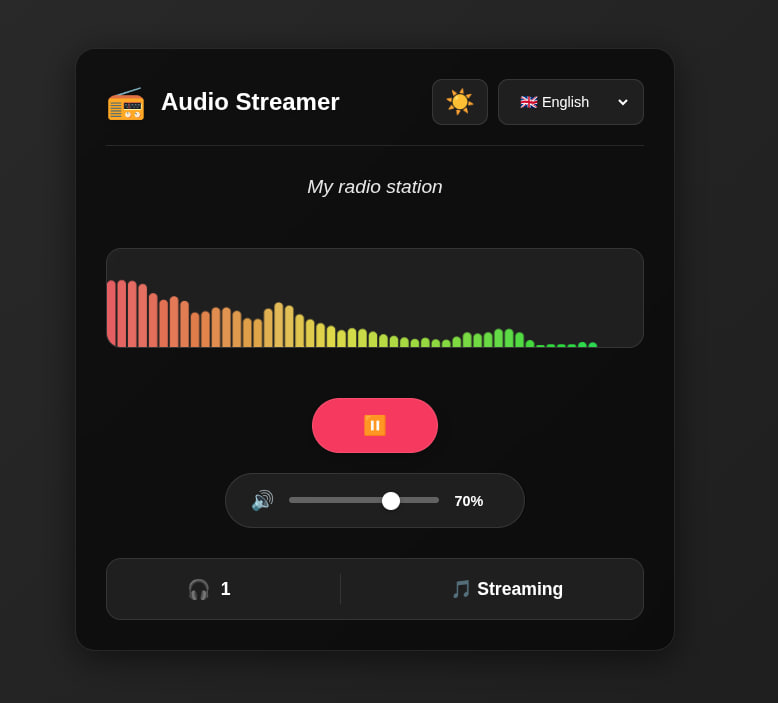
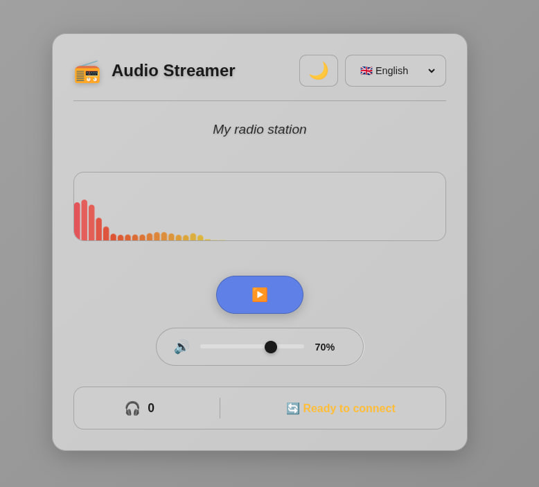

<div align="center">
  
  
  # Audio Streamer - Your Personal Radio Station
  
  <p align="center">
    <strong>Transform your computer into a professional radio station and broadcast your analog audio sources to the world.</strong>
  </p>
  
  <p align="center">
    
    
    
    
  </p>
</div>

---

<table>
<tr>
<td width="50%">

</td>
<td width="50%">

</td>
</tr>
</table>

<table>
<tr>
<td width="50%">

**Getting Started**
- [What You Can Do](#features---what-you-can-do)
- [Quick Start - 5 Minutes to Live](#quick-start---5-minutes-to-live)
- [Building Your Radio Station](#building-your-radio-station)
- [Going Global - Share Your Station](#going-global---share-your-station)

**Features & Configuration**
- [Professional Features](#professional-features)
- [Use Cases & Inspiration](#use-cases--inspiration)
- [Studio Configuration Guide](#studio-configuration-guide)
- [Listener Experience](#listener-experience)

</td>
<td width="50%">

**Operations & Support**
- [Troubleshooting](#troubleshooting---keep-your-station-running)
- [Broadcasting Statistics](#broadcasting-statistics)
- [Production Deployment](#production-deployment)
- [Security Best Practices](#security-best-practices)

**Advanced & Community**
- [Advanced Configuration](#advanced-configuration)
- [Success Stories](#success-stories--testimonials)
- [Contributing & Support](#contributing--support)
- [Quick Reference](#quick-reference)

</td>
</tr>
</table>

---

## Features - What You Can Do

> ⚠️ **Development Warning**: This project is still under active development. You may encounter bugs or malfunctions. Please report any issues you find to help improve the project.

<table>
<tr>
<td width="50%" bgcolor="#FFF3E0">
<strong>📡 Create Your Radio Station</strong><br/>
Stream from turntables, cassette decks, mixers, or any audio source
</td>
<td width="50%" bgcolor="#E3F2FD">
<strong>🎯 Smart Audio Selection</strong><br/>
Choose between microphone or audio interface for optimal compatibility
</td>
</tr>
<tr>
<td bgcolor="#F3E5F5">
<strong>🎨 Themed Interface</strong><br/>
6 professional themes (Jazz, Classical, Rock, Pop, Electronic, New Age)
</td>
<td bgcolor="#E8F5E9">
<strong>🌍 Multilingual Support</strong><br/>
Interface available in Italian, English, and German
</td>
</tr>
<tr>
<td bgcolor="#E1F5FE">
<strong>🌐 Share with Listeners</strong><br/>
Anyone with a web browser can tune in to your broadcast
</td>
<td bgcolor="#FFF3E0">
<strong>📱 Responsive Design</strong><br/>
Clean, modern interface that works on all devices
</td>
</tr>
<tr>
<td bgcolor="#FCE4EC">
<strong>⚡ Professional Features</strong><br/>
Auto-reconnect, error recovery, and real-time listener stats
</td>
<td bgcolor="#FFF9C4">
<strong>🔌 Zero Configuration</strong><br/>
Works out of the box with any audio device
</td>
</tr>
</table>

## Quick Start - 5 Minutes to Live

<table>
<tr>
<td>
<strong>⚡ Fast Setup</strong><br/>
Get your radio station live in just 5 minutes! Install dependencies, create your <code>.env</code> configuration file, and start broadcasting.
</td>
</tr>
</table>

### Step 1: Connect Your Audio Source
```
Microphone → Computer
OR
Turntable/Mixer → Audio Interface → Computer
```

### Step 2: Install & Configure
```bash
# Clone and install
git clone <this-repository>
cd audio-streamer

# Option 1: Quick install (recommended for new systems)
./install.sh

# Option 2: Manual install
# First install system dependencies for PyAudio:
sudo apt update && sudo apt install -y python3-dev portaudio19-dev
# Then install Python requirements:
pip install -r requirements.txt

# REQUIRED: Create configuration file
cp .env.example .env
nano .env  # Edit your settings

# Start your radio station
python app.py
```

**Note:** The `.env` file is **required**. The application will not start without it.

### Step 3: Choose Your Input Method
When you run the app, you'll see:
```
🎤 Choose your audio input method:
1. Microphone (built-in or USB mic)
2. Audio Interface (external sound card, line-in)
==================================================

Enter your choice (1 or 2):
```

### Step 4: Select Your Audio Device
Depending on your choice, you'll see available devices:

**For Microphone Mode:**
```
=== Available audio devices (arecord) ===
Option 1: Built-in Microphone (default)
Option 2: Line-in Jack (3.5mm)
==================================================

Choose a device index (1 for built-in mic, 2 for line-in, or ENTER for default):
```

**For Audio Interface Mode:**
```
=== Available Audio Devices ===
0: Your Audio Interface Name
1: Another Device...
==================================================

Choose device index(es) to stream from (or ENTER for default):
```

### Step 5: Go Live
1. Select your audio device from the list
2. Open `http://localhost:4986` in your browser
3. Click **Play** to start broadcasting
4. Choose your favorite theme from the dropdown

---

## Professional Features

<table>
<tr>
<td bgcolor="#E8F5E9">
<strong>🎨 Professional Broadcasting</strong><br/>
Enjoy enterprise-grade features including 6 stunning themes, auto-reconnect technology, and real-time analytics. Perfect for both hobbyists and professional broadcasters.
</td>
</tr>
</table>

### Multi-Theme Web Interface
- **Jazz Night**: Warm colors, vintage feel with sepia filter
- **Classical**: Elegant brown/beige, Times New Roman font
- **Rock**: Dark theme with red accents, bold borders
- **Pop**: Bright pastel colors, modern clean interface
- **Electronic**: Cyberpunk style with green text on black
- **New Age**: Ethereal blue gradients, minimal design
- **Modern**: Default purple/blue gradient theme

### Smart Web Player
- **Auto-Reconnect**: Never lose a listener - automatic retry on connection issues
- **Live Status**: Real-time connection indicators and listener count
- **Buffering Display**: Visual feedback during connection setup
- **Mobile Ready**: Works on phones, tablets, and desktops
- **Theme Switcher**: Instant theme changes without page reload

### Intelligent Audio Engine
- **Dual Engine Support**: 
  - **Microphone Mode**: Uses `arecord` for stable system audio capture with device selection
  - **Interface Mode**: Uses `PyAudio` for professional audio interfaces
- **Smart Device Selection**: 
  - Built-in microphone for voice/podcasting
  - Line-in jack (3.5mm) for external audio sources
  - Professional audio interfaces for music production
- **Thread-Safe**: Handle unlimited concurrent listeners
- **Error Recovery**: Automatic recovery from audio device issues
- **Professional Audio**: 44.1kHz CD-quality stereo streaming

### Real-Time Analytics
- **Listener Count**: See how many people are tuned in
- **Connection Status**: Monitor streaming health
- **Error Tracking**: Automatic logging of issues for troubleshooting

---

## Building Your Radio Station

### Microphone Broadcasting (Perfect for Podcasts/Voice)
```bash
python app.py
# Choose option 1: Microphone
# Select device:
#   1 = Built-in Microphone (for voice/podcasting)
#   2 = Line-in Jack (for external audio sources)
# Start broadcasting your voice!
```

### Line-in Audio Sources
Perfect for connecting:
- **Turntables** (with preamp)
- **Cassette decks**
- **Mixer outputs**
- **Smartphones/MP3 players** via 3.5mm cable
- **Musical instruments** with line-level output

```bash
python app.py
# Choose option 1: Microphone
# Select device 2: Line-in Jack
# Connect your audio source to 3.5mm input
# Start streaming!
```

### Professional Audio Interface Setup
```bash
python app.py
# Choose option 2: Audio Interface
# Connect your turntable/mixer/synth
# Select your audio interface
# Start professional streaming!
```

### Environment Configuration
```bash
# Configure your station
export AUDIO_STREAMER_HOST=0.0.0.0    # Accept connections from anywhere
export AUDIO_STREAMER_PORT=8080        # Custom port
export AUDIO_STREAMER_DEBUG=false      # Production mode

# Launch with process manager
pm2 start app.py --name "my-radio-station"
```

### Multi-Device Studio Setup
```
Device 0: USB Turntable (Left Channel)
Device 1: USB Turntable (Right Channel)  
Device 2: Mixer Backup
```
Enter: `0 1 2` when prompted to mix all sources

---

## Going Global - Share Your Station

### Local Network
```
Share: http://YOUR-COMPUTER-IP:4986
Example: http://192.168.1.100:4986
```

### Internet Broadcasting
1. **Port Forwarding**: Forward port 4986 on your router
2. **Get Public IP**: Visit `whatismyip.com`
3. **Share Link**: `http://YOUR-PUBLIC-IP:4986`

### Professional Setup (Recommended)
```nginx
# Nginx reverse proxy with SSL
server {
    listen 443 ssl;
    server_name radio.yourdomain.com;
    
    location / {
        proxy_pass http://localhost:4986;
        proxy_set_header Host $host;
    }
}
```

---

## Use Cases & Inspiration

### Podcasting & Voice Broadcasting
- **Podcast Recording**: Stream your voice directly to listeners
- **Live Commentary**: Real-time commentary for events or gaming
- **Voice Radio**: Personal radio station with microphone input

### Music & DJ Broadcasting
- **Vinyl Streaming**: Broadcast your record collection
- **DJ Sets**: Live DJ performances to global audience
- **Music Production**: Share your creations instantly

### Live Events
- Stream parties and gatherings
- Broadcast DJ sets live
- Share conference audio with remote attendees

### Professional Use
- In-store radio for businesses
- Background music for venues
- Audio distribution for large spaces

### Educational
- Language learning broadcasts
- School radio stations
- Educational podcast streaming

---

## Studio Configuration Guide

### Audio Sources That Work
- **Turntables**: Vinyl records (need preamp for most computers)
- **Cassette Decks**: Analog tapes and mixtapes
- **Mixers**: DJ controllers, audio mixers
- **Instruments**: Electric guitars, keyboards, synthesizers
- **Microphones**: Voice, instruments, ambient sound

### Professional Setup Tips
```
Volume Settings: 70-80% to avoid distortion
Audio Quality: Use 44.1kHz, 16-bit for best compatibility
Monitoring: Keep headphones connected to check audio quality
```

### Multiple Device Setup
```bash
# When prompted, enter multiple device numbers:
Available devices:
  0: Built-in Microphone
  1: USB Audio Interface
  2: Line-in

Your choice: 1 2  # Mix USB interface + line-in
```

---

## Listener Experience

### What Your Listeners See
- **Modern Radio Interface**: Clean, professional web player
- **Instant Connection**: No software installation required
- **Real-time Info**: Listener count and connection status
- **Mobile Optimized**: Works perfectly on smartphones

### Sharing Your Station
```
Direct Link: http://your-station:4986
Stream Only: http://your-station:4986/stream
Statistics: http://your-station:4986/stats
```

---

## Troubleshooting - Keep Your Station Running

<table>
<tr>
<td bgcolor="#FFEBEE">
<strong>🔧 Quick Solutions</strong><br/>
Most issues can be resolved in minutes. Check device connections, test audio sources, and verify permissions. Our comprehensive troubleshooting guide has you covered.
</td>
</tr>
</table>

### Common Issues & Quick Fixes

#### Microphone Issues
**"No sound from microphone"**
```bash
# Test built-in microphone directly
arecord -D default -d 3 test.wav && aplay test.wav

# Test line-in jack directly
arecord -D hw:0,2 -d 3 test.wav && aplay test.wav

# Check microphone permissions
pactl list sources | grep -i microphone

# Restart with correct device
python app.py  # Choose microphone option, then device 1 or 2
```

**"Choosing between built-in mic and line-in"**
- **Device 1**: Built-in microphone - perfect for voice, podcasts, commentary
- **Device 2**: Line-in jack (3.5mm) - for turntables, mixers, instruments
- **Default**: Press ENTER to use built-in microphone

**"Microphone quality is poor"**
- Check microphone distance (6-12 inches optimal for built-in mic)
- Reduce background noise
- Use line-in for better audio quality with external sources
- Adjust system input levels

#### Audio Interface Issues
**"Interface not detected"**
```bash
# Check if device is connected
arecord -l

# Test with PyAudio
python -c "import pyaudio; print('Devices:', pyaudio.PyAudio().get_device_count())"

# Restart with interface option
python app.py  # Choose audio interface option
```

**"Audio sounds distorted"**
- Lower input gain on interface
- Check for clipping indicators
- Use proper cable connections
- Ensure sample rate compatibility

#### Connection Issues
**"Listeners can't connect"**
```bash
# Check firewall settings
sudo ufw allow 4986  # Linux

# Test local connection
curl http://localhost:4986/stats

# Check network accessibility
netstat -tlnp | grep 4986
```

**"Connection keeps dropping"**
- The auto-reconnect will handle temporary issues
- Check your internet connection stability
- Verify audio device isn't being used by other apps
- Monitor system resources

### Professional Monitoring
```bash
# Monitor logs for issues
tail -f /var/log/audio-streamer.log

# Check system resources
htop  # Monitor CPU/memory usage
```

---

## Broadcasting Statistics

### Real-Time Monitoring
Visit `http://your-station:4986/stats` to see:
```json
{
  "on_air": true,
  "listeners": 42,
  "sample_rate": 44100,
  "channels": 2
}
```

### Performance Metrics
- **Concurrent Listeners**: Unlimited (limited by your bandwidth)
- **Audio Quality**: CD-quality 44.1kHz stereo
- **Latency**: ~2 seconds (optimal for streaming)
- **Bandwidth**: ~176 KB/s per listener

---

## Production Deployment

<table>
<tr>
<td bgcolor="#F3E5F5">
<strong>🚀 Enterprise Ready</strong><br/>
Deploy your station for 24/7 operation with native deployment. Direct hardware access ensures optimal audio quality and compatibility with professional audio interfaces.
</td>
</tr>
</table>

### Why Native Deployment?

**Audio hardware requires direct system access:**
- Professional audio interfaces need kernel-level drivers
- Docker containers add latency and compatibility issues
- USB audio devices may not work properly in containers
- Native deployment = zero latency, full hardware support

### 24/7 Radio Station with PM2

```bash
# Install PM2 process manager
npm install -g pm2

# Start your station
pm2 start app.py --name "radio-station" --interpreter python3

# Monitor in real-time
pm2 monit

# View logs
pm2 logs radio-station

# Auto-restart on system reboot
pm2 startup
pm2 save

# Restart after code changes
pm2 restart radio-station
```

### Systemd Service (Linux)

For production servers, use systemd for automatic startup.

A ready-to-use service file is included: `audio-streamer.service`

```bash
# Edit the service file with your paths
nano audio-streamer.service

# Copy to systemd directory
sudo cp audio-streamer.service /etc/systemd/system/

# Reload systemd
sudo systemctl daemon-reload
```

```ini
[Unit]
Description=Audio Streamer Radio Station
After=network.target sound.target

[Service]
Type=simple
User=your-username
WorkingDirectory=/path/to/audio-streamer
Environment="AUDIO_STREAMER_DEBUG=false"
ExecStart=/usr/bin/python3 /path/to/audio-streamer/app.py
Restart=always
RestartSec=10

[Install]
WantedBy=multi-user.target
```

```bash
# Enable and start service
sudo systemctl enable audio-streamer
sudo systemctl start audio-streamer

# Check status
sudo systemctl status audio-streamer

# View logs
sudo journalctl -u audio-streamer -f
```

---

## Security Best Practices

### Basic Security
```bash
# Disable debug mode in production
export AUDIO_STREAMER_DEBUG=false

# Use firewall to restrict access
sudo ufw allow from 192.168.1.0/24 to any port 4986
```

### Professional Security
- Use reverse proxy with SSL termination
- Implement rate limiting for connections
- Monitor for unusual connection patterns
- Regular security updates

---

## Advanced Configuration

### Configuration File (.env)

**The `.env` file is mandatory.** The application will not start without it.

All settings must be configured via the `.env` file:

```bash
# Copy the example file (REQUIRED)
cp .env.example .env

# Edit your configuration
nano .env
```

**Available settings:**

```bash
# Audio Configuration
AUDIO_CHUNK=1024              # Buffer size (512-4096)
AUDIO_CHANNELS=2              # 1=mono, 2=stereo
AUDIO_RATE=44100              # Sample rate (22050, 44100, 48000)

# Network Configuration
AUDIO_STREAMER_HOST=0.0.0.0   # Bind address
AUDIO_STREAMER_PORT=4986      # Server port
AUDIO_STREAMER_DEBUG=False    # Debug mode

# Streaming Configuration
AUDIO_STREAMER_MAX_CLIENTS=10      # Max concurrent listeners
AUDIO_STREAMER_QUEUE_SIZE=100      # Buffer queue size
```

### Audio Quality Tuning

**Lower Latency (for live performances):**
```bash
AUDIO_CHUNK=512
AUDIO_RATE=44100
```

**Higher Quality (for music streaming):**
```bash
AUDIO_CHUNK=2048
AUDIO_RATE=48000
```

**Lower Bandwidth (for limited connections):**
```bash
AUDIO_CHUNK=1024
AUDIO_RATE=22050
AUDIO_CHANNELS=1
```

---

## Success Stories & Testimonials

### Bedroom DJ to Global Station
> "I started with just my turntable and now have listeners in 15 countries. The auto-reconnect feature means my station never goes down!" - DJ Mike

### Community Radio Station
> "We replaced our $10,000 broadcasting equipment with this simple setup. It's more reliable and easier to use!" - Community Radio FM

### Live Event Streaming
> "We use it to broadcast our music festivals. People who can't attend can still enjoy the show live!" - Festival Organizer

---

## Contributing & Support

### Help Improve Your Radio Station
- Report bugs and request features
- Share your setup and success stories
- Contribute code improvements
- Help others in the community

### Technical Support
- **Documentation**: This README covers everything you need
- **Troubleshooting**: Check the common issues section
- **Community**: Share experiences and get help from other broadcasters

---

## Quick Reference

### Essential Commands
```bash
# Start station
python app.py

# Custom port
AUDIO_STREAMER_PORT=8080 python app.py

# Production mode
AUDIO_STREAMER_DEBUG=false python app.py

# Check stats
curl http://localhost:4986/stats
```

### Important URLs
- **Radio Player**: `http://localhost:4986`
- **Audio Stream**: `http://localhost:4986/stream`  
- **Statistics**: `http://localhost:4986/stats`

### Audio Device Tips
- **Built-in Microphone**: Choose option 1, then device 1 for voice/podcasting
- **Line-in Jack**: Choose option 1, then device 2 for external audio sources
- **Audio Interface**: Choose option 2 for professional music production
- **Test First**: Always test your device before going live
- **Quality**: Use line-in or audio interfaces for best sound quality with external sources

---